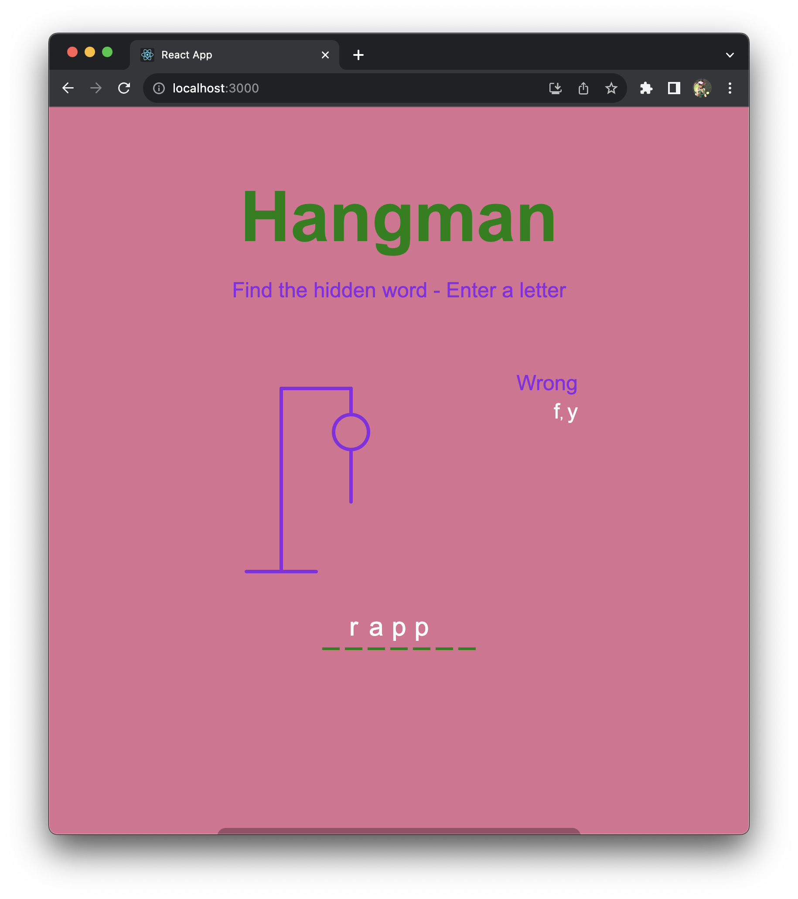

# Hangman

A hangman game project created following: https://www.youtube.com/watch?v=jj0W8tYX_q8

I altered the project by using random-words to generate words instead of a set of five words

## Technologies

- Javascript: addEventListener, setTimeout, map, reduce
- React: random-words, useEffect, useState
- CSS
